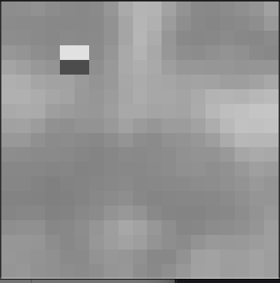
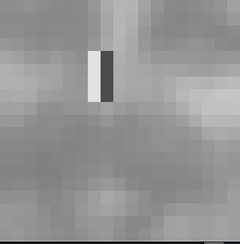
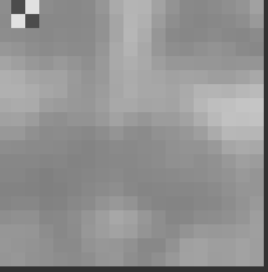
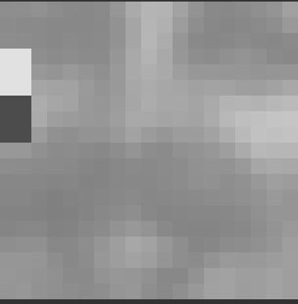

# Report

The basic idea of Viola Jones Algorithm is to calculate the haar features of the image from multi dimensions using the gray-scale integral image, then apply AdaBoost on these haar features to generate a classification result. Further, in order to skip some useless calculation on non-face areas in a image and speed up training process, the paper discussed an idea of constructing cascaded classifiers by concatenating multiple strong classifiers in series.

<br/>

### Integral Image

------

Integral Image is used to speed up calculating the sum of a rectangle area in a 2D matrix. 

Each element in an integral image represents the cumulative sum from (0, 0) to the current point. 


We can easily calculate the sum of a rectangle area by using the integral image in the following way: 


In this way, it only takes constant time to get the sum of area ABCD.

<br/>

### Haar Features

-------

Haar Feature is a common feature description operator in the field of computer vision. It goes like the following:


The Viola Jones algorithm mainly uses the above five kinds of feature prototypes: two-horizontal, two-vertical, three-horizontal, three-vertical, four. Feature prototypes are generated by connecting black and white rectangles.

Then, let's see for a given image, how many haar features it can have. Our dataset is of images that are 19 × 19. We first consider the two-vertical features. For the given width and height limitation of 19, apparently  it can have the following possible rectangles:1×2, 1×4,1×6, … 1×18,, 2×2, 2×4, … 2×18, 3×2… 19×18. 

Similarily, for three-vertical features, it can have the following possible rectangles: 1×3, 1×6, 1×9, … 19×18.

For four features, it can have the following possible rectangles: 2×2, 2×4, 2×8, 2×16, … 18×18.

Therefore, we can write some code to implement the function of generating these kinds of features:

```python
def gen_features(width: int, height: int, feature_type: FeatureType) -> Iterable[Feature]:
    features = list()

    for size_x in range(feature_type[0], width + 1, feature_type[0]):
        for size_y in range(feature_type[1], height + 1, feature_type[1]):
            for x in range(width - size_x + 1):
                for y in range(height - size_y + 1):
                    if feature_type == FeatureType.TWO_HORIZONTAL:
                        features.append(Feature2h(x, y, size_x, size_y))
                    elif feature_type == FeatureType.TWO_VERTICAL:
                        features.append(Feature2v(x, y, size_x, size_y))
                    elif feature_type == FeatureType.THREE_HORIZONTAL:
                        features.append(Feature3h(x, y, size_x, size_y))
                    elif feature_type == FeatureType.THREE_VERTICAL:
                        features.append(Feature3v(x, y, size_x, size_y))
                    elif feature_type == FeatureType.FOUR:
                        features.append(Feature4(x, y, size_x, size_y))
    return features

SIZE = (19, 19)

features_2h = gen_features(SIZE[0], SIZE[1], FeatureType.TWO_HORIZONTAL)
features_2v = gen_features(SIZE[0], SIZE[1], FeatureType.TWO_VERTICAL)
features_3h = gen_features(SIZE[0], SIZE[1], FeatureType.THREE_HORIZONTAL)
features_3v = gen_features(SIZE[0], SIZE[1], FeatureType.THREE_VERTICAL)
features_4 = gen_features(SIZE[0], SIZE[1],  FeatureType.FOUR)
features = features_2h + features_2v + features_3h + features_3v + features_4
```

To calculate the value of each features, we need to use the sum of the white part to minus the sum of the black part. So we can use the integral image to calculate the sum of each part in the haar feature.

<br/>

### Adaboost

-----------------

AdaBoost can combine a series of "weak" classifiers into a "strong" classifier by linear combination. So our first step is to build our weak classifiers. 

To build the weak classifiers, I calculated the maximum and minimum value of each feature column so that I can get the range. Then in order to determine what is the best threshold for this single decision stump, I split the range into 10 even interval, then just iterate the end of each interval and let it be our threshold. After iterating all thresholds, we record the best one as our threshold for this stump. Then, after iterating all feature columns, we can get a best decision stump which minimizes the empirical error. 

After determining the weak classifier in this round, we need to adjust the weight of each sample and give each classifer a parameter `a`.

Then, repeat this process until we have completed the required rounds or the training error is 0.

The result of this part is in the section **Testing**.

<br/>

### Adjust Threshold

---------

In the real world, there are different standards for the face detection system. We may want to eliminate as much false alarm as possible in daily life, for example, we can tolerate not being recognized as a face but cannot tolerate the whole environment are all recognized as faces. However, if we need to build a system for security reasons, we may not want to miss any of the suspicious moves.

In order to solve this problem, we can use the false positive rate and false negative rate as the metrics to judge our weak classifiers. 

The result of this part is in the section **Testing**.

<br/>

### Build the Cascading System

-------

I haven't finished this section yet.

<br/>

### Testing

-----

#### Extract Haar Features

After generating the haar features, we can get:

```
+++++ generate possible features +++++

Number of two-rectangle-horizontal features: 17100
Number of two-rectangle-vertical features: 17100
Number of three-rectangle-horizontal features: 10830
Number of three-rectangle-vertical features: 10830
Number of four-rectangle features: 8100
Total number of features: 63960
```


#### AdaBoost Detector

To train and classify all dataset, it takes about 5 hours for my program to finish all the work. And main bottleneck I found is the step of calculating Haar Features. I don't know whether I call some function in an incorrect way and I have no time to check this issue.

Anyway, the running result of each round is like the below:

```
Adaboost rounds: 1
Type: TWO_VERTICAL
Position: (4, 4)
Width: 2
Height: 2
Threshold: 0.078432
Training accuracy: 0.837135
Total accuracy: 0.818439
False Positive: 372
False Negative: 77
```




```
Adaboost rounds: 3

Type: TWO_HORIZONTAL
Position: (10, 4)
Width: 2
Height: 6
Threshold: -0.180392
Training accuracy: 0.879552
Total accuracy: 0.811161
False Positive: 439
False Negative: 28
```




```
Adaboost rounds: 5
Type: FOUR
Position: (0, 1)
Width: 2
Height: 2
Threshold: -0.047843
Training accuracy: 0.899560
Total accuracy: 0.810352
False Positive: 453
False Negative: 16
```




```
Adaboost rounds: 10
Type: TWO_VERTICAL
Position: (3, 0)
Width: 3
Height: 4
Threshold: 0.134118
Training accuracy: 0.931973
Total accuracy: 0.810756
False Positive: 459
False Negative: 9
```




There must be something wrong with my code of the building decision stump part. It will always tend to predict a image as a non-face image. I haven't found the reason causes this issue yet.


#### Adjust Threshold

```
+++++ Train with empirical error +++++
Adaboost rounds: 5
Total accuracy: 0.810352
False Positive: 453
False Negative: 16

+++++ Train with the false-positive rate +++++
Adaboost rounds: 5
Total accuracy: 0.809139
False Positive: 435
False Negative: 38

+++++ Train with the false-negative rate +++++
Adaboost rounds: 5
Total accuracy: 0.804691
False Positive: 470
False Negative: 1
```

| Criterion       | Total Accuracy | False Positive | False Negative |
| --------------- | -------------- | -------------- | -------------- |
| Empirical Error | 81%            | 90%            | 1%             |
| False Positive  | 81%            | 87%            | 1%             |
| False Negative  | 80%            | 94%            | 0%             |

It does decrease the false-positive rate and false-negative rate.

<br/>

### Further  Improvements

-----

For my AdaBoost implementation, I set a even step size for finding the best threshold for each decision stump. If the feature's distribution is not that even, for example, the range is from 0 to 100, but 95% data is between [0, 1], then my AdaBoost implementation will be very bad.

So I searched another approach to implement it. It's much better than my implementation: After calculating all feature values, sort it in ascending order, then randomly pick one as the threshold. All elements are divided into two parts, the part less than the threshold is classified as face, and the part greater than the threshold is classified as non-face.

As shown in the figure below, red represents human face and blue represents non-face.


If there are 5 samples, the first two are human faces and the last three are non human faces, which are expressed by 11000.

If the threshold value is before the first one, it is determined as 00000 by weak classifier, and there are two errors,

If the threshold value is between the first and the second, it is determined as 10000 by the weak classifier, and there is one error,

If the threshold value is between the second and the third, it is determined as 11000 by weak classifier, with 0 error,

In this way, there are 6 errors in total, and then find the one with the smallest error as the threshold.

It will have a better performance compared to my implementation. And I'm also thinking about that whether my even step implementation caused the issue of tending to predict a image as a non-face one.